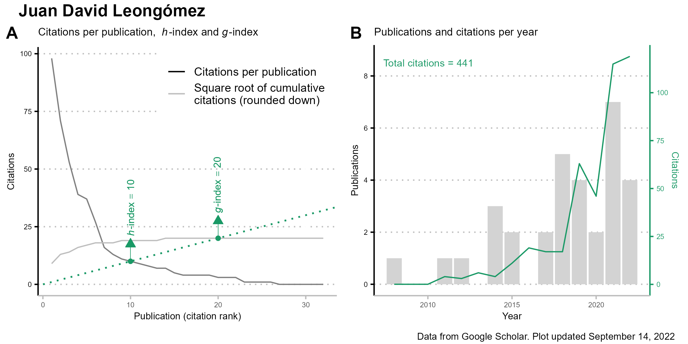

# ***ScolarlyOutput*** 
Plot Plot your scholarly output using the [<code>scholar</code>](https://cran.r-project.org/web/packages/scholar/vignettes/scholar.html) R package 

<!-- badges: start -->

[](https://github.com/JDLeongomez/ScolarlyOutput/blob/main/LICENSE)
<!-- badges: end -->

**_ScolarlyOutput_** is a small R Shiny app for creating and exporting a complete plot of your academic [**Google Scholar**](https://scholar.google.com/) profile.

It only requires the full link to your Google Scholar profile (just copy it and paste it in the box), and it will create a plot with your name (as it appears on your Google Scholar profile) and two panels:

<ol type="A">
  <li><b>Citations per publication</b> including both your h-index and, importantly, <a href="https://en.wikipedia.org/wiki/G-index">g-index</a> (which I have never seen in plots before)</li>
  <li><b>Number of publications and citations per year</b> including total number of citations</li>
</ol>

Below is an example of the **_ScolarlyOutput_** UI showing a plot of my own profile:


You can change an accent colour and filter publications.


Once you are happy, the plot can be exported to **PNG**, **PDF**, and even **SVG** format in case you want to edit it (the downloaded file will be named <code>Scholar_profile.png</code>, only changing the file extension depending in the format you selected).

The downloaded plot (in this case, as PNG) looks like this:



This app uses the fantastic [<code>scholar</code>](https://cran.r-project.org/web/packages/scholar/vignettes/scholar.html) R package to extract the info from your Google Scholar profile, and then several packages (mostly [<code>tidyverse</code>](https://www.tidyverse.org/) packages including [<code>ggplot2</code>](https://ggplot2.tidyverse.org/)) to wrangle and plot these data.

## How to run it

Sadly, the [<code>scholar</code>](https://cran.r-project.org/web/packages/scholar/vignettes/scholar.html) package cannot be run from a server like shinyapps.io, so this app must be run locally in your computer with R installed.

However, running it is very easy: you can simply run the code below in R:

```R
library(shiny)
runGitHub("ScolarlyOutput", "JDLeongomez")
```
Alternatively, you can always clone or [download](https://github.com/JDLeongomez/ScolarlyOutput/archive/refs/heads/main.zip) the **_ScolarlyOutput_** repository, and run the [<code>app.R</code>](https://github.com/JDLeongomez/ScolarlyOutput/blob/main/app.R) file.

<details>
  <summary><b>Click here to make sure you have all the necessary packages installed</b></summary>
<br>Please note that the <code>shiny</code> package must be installed. Other R packages used in this app include <code>thematic</code>, <code>shinythemes</code>, <code>colourpicker</code>, <code>stringr</code>, <code>scholar</code>, <code>dplyr</code>, <code>tidyr</code>, <code>ggplot2</code>, <code>ggpubr</code>, <code>scales</code>, and <code>purrr</code>.<br><br>

If you want, you can first run the following code, which will check which of these packages are already installed on your computer, and install the missing ones (if any).

```R
# Required packages
packages <- c("shiny", 
            "thematic", 
            "shinythemes", 
            "colourpicker", 
            "stringr", 
            "scholar", 
            "dplyr", 
            "tidyr", 
            "ggplot2", 
            "ggpubr", 
            "scales", 
            "purrr")
# Install packages not yet installed
installed_packages <- packages %in% rownames(installed.packages())
if (any(installed_packages == FALSE)) {
 install.packages(packages[!installed_packages])
}
```
</details>

## Why I made this super small app 

I originally wrote a script to download data from Google Scholar and make these plots for a particular version of my CV. However, several friends liked it and wanted to make plots of their own profiles (and be able to easily update them), so I decided to turn the code into a Shiny App for anyone to use.
